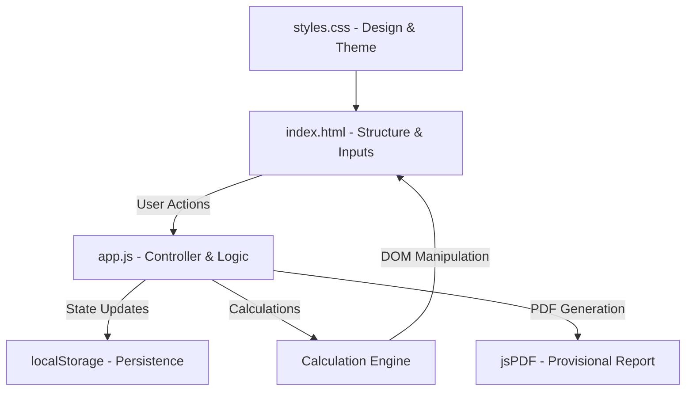
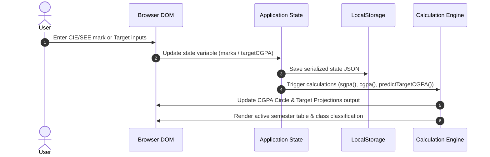

# VCGPA Application Architecture Documentation

This document explains the technical architecture, design patterns, state management, calculation pipeline, and data flow of **VCGPA** (VTU 2022 Scheme CGPA Calculator).

---

## System Overview

VCGPA is a client-side Single Page Application (SPA) designed to compute SGPA and CGPA for engineering students under the Visvesvaraya Technological University (VTU) 2022 Scheme. 

It is built as a zero-dependency (except for `jsPDF` for reporting) HTML5, CSS3, and JavaScript app.



---

## Architectural Components

### 1. Presentation Layer (`index.html` & `styles.css`)
* **index.html**: Defines a responsive layout split into a sidebar (for student metadata, target settings, and the overall CGPA summary) and a main panel (for semester tabs, marks input grid, and navigation controls).
* **styles.css**: Houses the typography and design system. It uses CSS variables (`:root`) for color themes, supports micro-animations (hover transitions, active fills), and provides semantic classes for grades/classification badges (e.g., `.dist`, `.first`, `.second`, `.fail`).

### 2. State & Persistence (`app.js`)
The application is state-driven. All operations modify a global `state` object, which is synced to `localStorage` on change.

```javascript
let state = {
  branch: 'CSE',            // Active branch code
  group: 'physics',         // First-year cycle group (physics/chemistry)
  sem: 0,                   // Active semester tab index (0-7)
  student: {                // Student profile metadata
    name: '',
    usn: '',
    college: '',
    year: ''
  },
  marks: {},                // Course marks mapping (CIE & SEE)
  custom: {},               // User-customized course names and codes
  targetCGPA: '',           // Target CGPA setting (Predictor Engine)
  semsRemaining: ''         // Future semesters count (Predictor Engine)
};
```
* **Key Generation**: Marks and custom course details are stored using a structured composite key:
  * Marks: `${branch}|${group}|${semIndex}|${courseCode}|${marksType}` (e.g., `CSE|physics|2|BCS304|cie`)
  * Customizations: `${branch}|${group}|${semIndex}|${courseCode}|${field}`

### 3. Calculation Engine (`app.js`)
The calculation engine operates dynamically on user input. It handles grade point boundaries, detention checks, SGPA, CGPA, and target prediction calculations.

#### A. Course Grade Decision Table
Each course grade is determined by combined CIE (Continuous Internal Evaluation) and SEE (Semester End Evaluation) marks:

| Condition | Grade | Points | Classification / Inclusion |
| :--- | :---: | :---: | :--- |
| $\text{CIE} < 40\%$ of Max CIE (for courses with SEE) | `DX` | 0 | **Detained**: Course is excluded from credits denominator |
| $\text{SEE} < 35\%$ of Max SEE (for courses with SEE) | `F` | 0 | **Fail**: Credits included, 0 points earned |
| $\text{Total Marks} < 40\%$ of Max | `F` | 0 | **Fail**: Credits included, 0 points earned |
| $\text{Total Percentage} \ge 90\%$ | `O` | 10 | Outstanding |
| $80\% \le \text{Total Percentage} < 90\%$ | `A+` | 9 | Excellent |
| $70\% \le \text{Total Percentage} < 80\%$ | `A` | 8 | Very Good |
| $60\% \le \text{Total Percentage} < 70\%$ | `B+` | 7 | Good |
| $55\% \le \text{Total Percentage} < 60\%$ | `B` | 6 | Above Average |
| $50\% \le \text{Total Percentage} < 55\%$ | `C` | 5 | Average |
| $40\% \le \text{Total Percentage} < 50\%$ | `P` | 4 | Pass |

#### B. Formulas
* **SGPA (Semester Grade Point Average)**:
  $$\text{SGPA} = \frac{\sum (\text{Grade Point} \times \text{Credits})}{\sum \text{Credits}}$$
  *Note: Excludes courses with 0 credits (non-credit courses) and courses marked detained (`DX`).*

* **CGPA (Cumulative Grade Point Average)**:
  $$\text{CGPA} = \frac{\sum_{\text{all sems}} \sum (\text{Grade Point} \times \text{Credits})}{\sum_{\text{all sems}} \sum \text{Credits}}$$

#### C. Target CGPA Predictor Math
Given a target CGPA ($T$) and remaining semesters ($R$):
1. **Earned Metrics**: Compute total credits earned ($C_{\text{earned}}$) and grade points earned ($GP_{\text{earned}}$) across all completed courses.
2. **Remaining Credits**: Dynamically query the curriculum database to sum the total credit-bearing hours ($C_{\text{rem}}$) of the last $R$ semesters of the branch syllabus.
3. **Required Future Points**:
   $$GP_{\text{req}} = T \times (C_{\text{earned}} + C_{\text{rem}})$$
   $$GP_{\text{future}} = GP_{\text{req}} - GP_{\text{earned}}$$
4. **Target SGPA**:
   $$\text{SGPA}_{\text{req}} = \frac{GP_{\text{future}}}{C_{\text{rem}}}$$

---

## Data Flow Diagram

The following diagram illustrates how user interactions trigger state mutations, recalculate academic metrics, and render visual changes to the DOM:



---

## Reporting & Quality Assurance

### PDF Report Generator (`jsPDF`)
The provisional report generator compiles all student details, semester grade tables, academic summaries, and target projections into a single PDF:
* **Layout Design**: Uses coordinate-based vector lines, filled headers (Navy `#103f78`), text grids, and bold typography.
* **Overflow Protection**: Tracks current drawing cursor `y`. If `y` exceeds page limits (e.g., `282`), a new page is added, resetting `y` to `16`.
* **Projections Card**: Positioned at a fixed container at the bottom of Page 1 (at `y = 245`). Spacing is reserved dynamically to prevent subject data overlap.

### Automated Test Suite (`test_suite.js`)
* Runs directly in Node.js using file-system reads and context emulation.
* **DOM Mocking**: Emulates DOM nodes and properties so browser code executes seamlessly under Node.js.
* **Test Scope**: Asserts accuracy of grade boundary values, course exclusion criteria (detention), multi-semester summation, and prediction mathematical stability.
